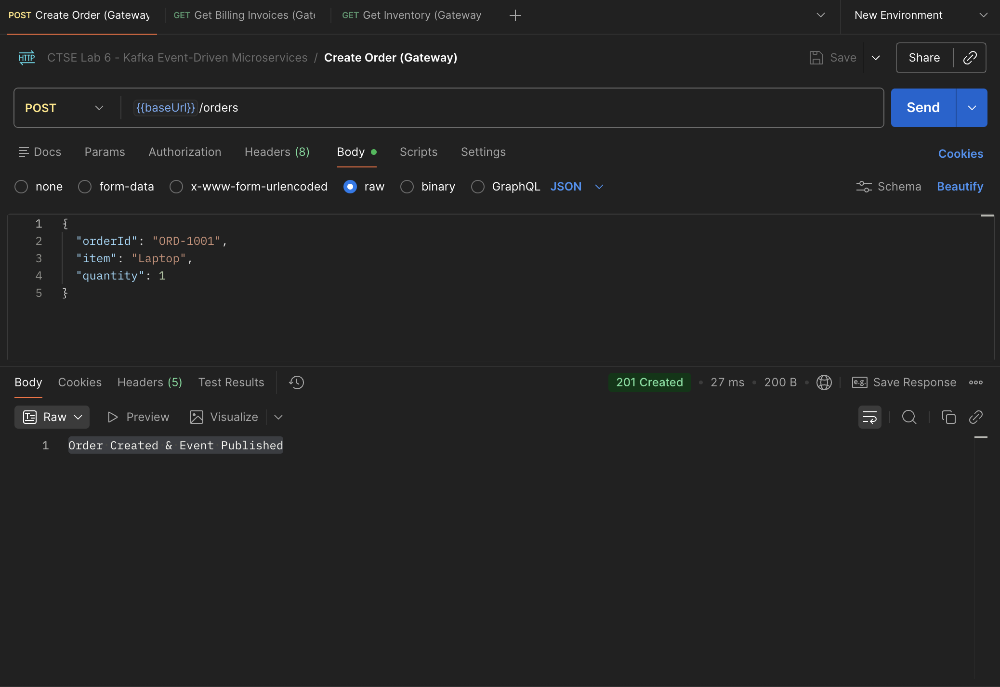
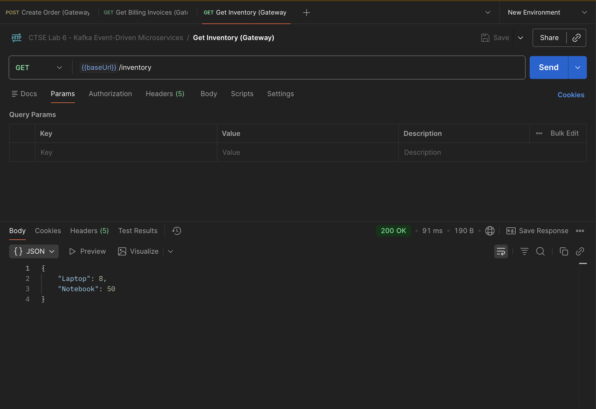
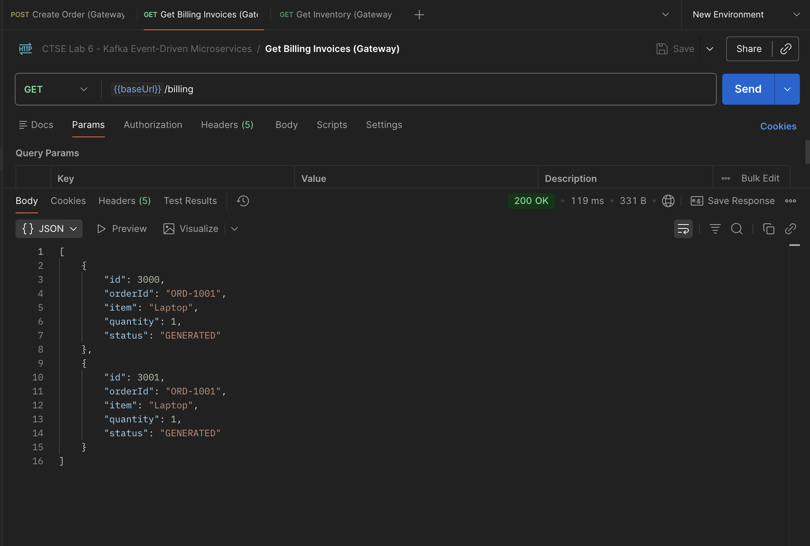
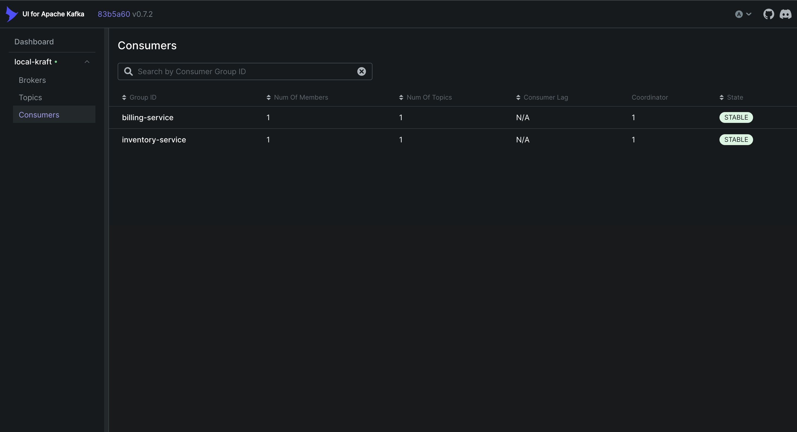
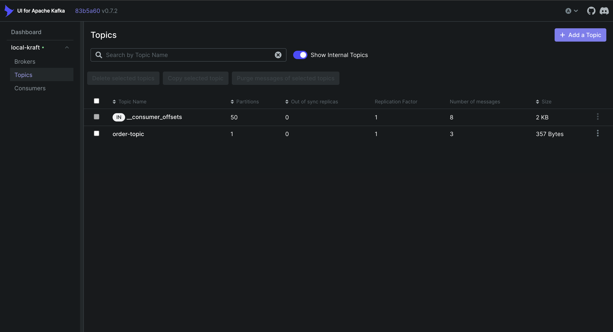
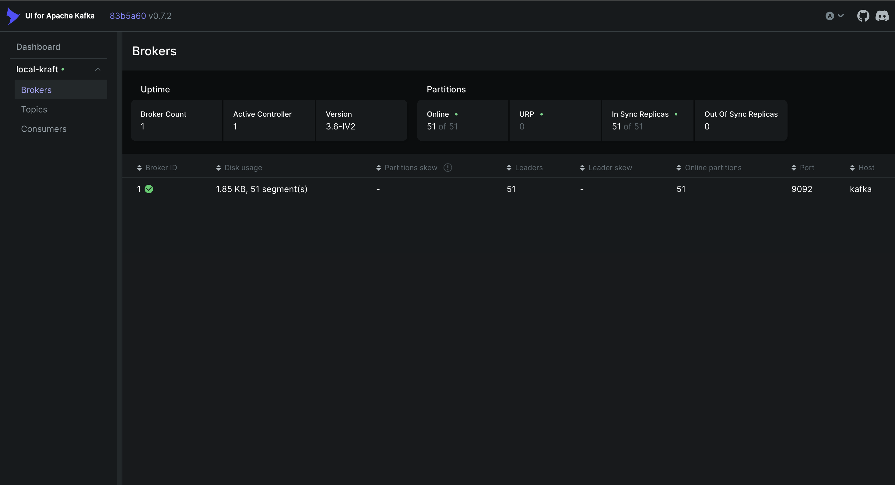

# CTSE Lab 6 – Event-Driven Microservices with Kafka (KRaft)

All Docker builds must run from the **repo root** (`sliit-ctse-lab-06/`):

**Build + Run (recommended)**
```bash
cd sliit-ctse-lab-06
docker compose up --build
```

**Build Images Only**
```bash
cd sliit-ctse-lab-06
docker compose build
```

**Build Single Service Images (run from repo root)**
```bash
docker build -t order-service:latest -f order-service/Dockerfile .
docker build -t inventory-service:latest -f inventory-service/Dockerfile .
docker build -t billing-service:latest -f billing-service/Dockerfile .
docker build -t api-gateway:latest -f api-gateway/Dockerfile .
```

**Postman**
Import the collection: `CTSE_Lab_6.postman_collection.json` from the repo root.

**Kafka UI**
Kafka UI is available at `http://localhost:8084` (Provectus Kafka UI).
Use it to view `order-topic` and verify events are published.

**Kafka Basics (No Prior Experience Needed)**
Kafka is a message bus. One service sends a message to Kafka; other services read it later. The services do not call each other directly.

**Key Terms**
- Topic: a named channel in Kafka. Here it’s `order-topic`.
- Producer: a service that sends messages to a topic. Here it’s `order-service`.
- Consumer: a service that reads messages from a topic. Here it’s `inventory-service` and `billing-service`.
- Event: the message itself. Here it’s the JSON order data.

**System Flow**
1. Client sends `POST /orders` to the API Gateway (port 8080).
2. API Gateway forwards to Order Service (port 8081).
3. Order Service publishes the order JSON to Kafka topic `order-topic`.
4. Kafka stores the message.
5. Inventory Service consumes it and updates stock.
6. Billing Service consumes it and generates an invoice.

**Why Kafka Here**
- Services are loosely coupled.
- If Billing is down, Order still works.
- New services can subscribe to `order-topic` without changing Order Service.

**How It’s Wired (Code Concepts)**
- Producer (Order Service): `kafkaTemplate.send("order-topic", json)`
- Consumers (Inventory/Billing): `@KafkaListener(topics = "order-topic", groupId = "...")`

**How to Observe It Working**
```bash
docker compose logs -f inventory-service billing-service
```
You should see logs indicating inventory updates and invoice generation after a new order is posted.

**Screenshots**










